<div align="center">

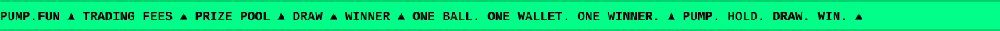

<br />


<br />

**[HOW IT WORKS](#how-it-works)** &nbsp;·&nbsp; **[DRAW ENGINE](#draw-engine)** &nbsp;·&nbsp; **[THE BALL](#the-ball)** &nbsp;·&nbsp; **[TRANSPARENCY](#transparency)** &nbsp;·&nbsp; **[DRAW HISTORY](#draw-history)** &nbsp;·&nbsp; **[DOCS](#docs)**

</div>

<br />

> **PUMPBALL is a Powerball-style token built directly on Pump.fun.**
> No custom launchpad. Pump.fun token activity generates fees, those fees accumulate into a prize pool, and at predetermined drawings eligible PUMPBALL holders have a chance to win it.

**Pump.fun + Powerball.** A crypto-native lottery machine running on top of Pump.fun.

<br />


<a id="how-it-works"></a>
<h2 align="center"></h2>

<p align="center"></p>

| Stage | What happens |
| :--- | :--- |
| **PUMP.FUN** | PUMPBALL lives natively on Pump.fun. Nothing custom to launch or trust. |
| **TRADING FEES** | Trading activity on the token generates fees. |
| **PUMPBALL** | Fees are routed toward the PUMPBALL prize pool. |
| **PRIZE POOL** | The pool accumulates between draws. |
| **DRAW** | At a predetermined drawing, eligible holders are entered. |
| **WINNER** | One wallet wins the accumulated prize. |

<br />

<a id="draw-engine"></a>
<h2 align="center"></h2>

<p align="center"></p>
<p align="center"></p>

<details>
<summary><b>Plain text version</b></summary>

```text
PUMPBALL // DRAW ENGINE

STATUS        ONLINE
NETWORK       SOLANA
SOURCE        PUMP.FUN
POOL          ACCUMULATING
ENTRIES       HOLDERS
NEXT DRAW     PENDING

> waiting for the ball...
```

</details>

<br />

<a id="the-ball"></a>
<h2 align="center"></h2>

<table>
<tr>
<td width="46%" align="center" valign="middle">
</td>
<td valign="middle">

Every eligible wallet is effectively holding a ticket.

No dashboard.<br />
No separate launchpad.<br />
No unnecessary infrastructure.

```text
┌────────────────────────────────┐
│  PUMPBALL // TICKET            │
│                                │
│  HOLDER    eligible wallet     │
│  ENTRY     hold PUMPBALL       │
│  DRAW      predetermined       │
└────────────────────────────────┘
```

</td>
</tr>
</table>

<p align="center">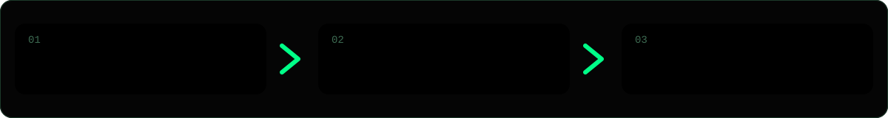</p>

<h3 align="center">BUY PUMPBALL → HOLD PUMPBALL → ENTER THE DRAW</h3>

<br />

<a id="fee-flow"></a>
<h2 align="center"></h2>

```text
            PUMP.FUN
               │
         trading activity
               │
               ▼
          ┌─────────┐
          │  FEES   │
          └────┬────┘
               │
               ▼
       ┌───────────────┐
       │ PUMPBALL POOL │
       └───────┬───────┘
               │
               ▼
             DRAW
               │
               ▼
            WINNER
```

<br />

<a id="transparency"></a>
<h2 align="center"></h2>

Everything below gets published here. Nothing is filled in until it exists on-chain.

<!-- TRANSPARENCY:START -->
| Item | Value |
| :--- | :--- |
| **Contract Address** | `CA: TBA` |
| **Prize Wallet** | `TBA` |
| **Draw History** | [see draw history](#draw-history) |
| **Winner Transactions** | `TBA` |
<!-- TRANSPARENCY:END -->

> Source of truth: [`data/draws.json`](./data/draws.json). Run `npm run history` to re-render these tables.

<details>
<summary><b>How to verify</b></summary>

<br />

Do not take anyone's word for it, including this README. Once addresses are published:

1. Confirm the contract address matches the token on Pump.fun.
2. Check the prize wallet balance on a Solana block explorer.
3. Match every winner transaction against the draw history below.

Full checklist: [`docs/VERIFY.md`](./docs/VERIFY.md)

</details>

<details>
<summary><b>Draw parameters</b></summary>

<br />

| Parameter | Value |
| :--- | :--- |
| Draw schedule | `TBA` |
| Eligibility rules | `TBA` |
| Winner selection method | `TBA` |
| Prize payout method | `TBA` |

Details: [`docs/DRAW_RULES.md`](./docs/DRAW_RULES.md)

</details>

<br />

<a id="draw-history"></a>
<h2 align="center"></h2>

<!-- DRAW_HISTORY:START -->
| Draw | Prize | Winner | TX  |
| ---- | ----: | ------ | --- |
| #001 | TBA | TBA | TBA |
<!-- DRAW_HISTORY:END -->

<br />

<a id="repo-map"></a>
<h2 align="center"></h2>

```text
pumpball/
├── README.md
├── LICENSE
├── package.json
├── CONTRIBUTING.md
├── SECURITY.md
├── CODE_OF_CONDUCT.md
│
├── assets/                  animated SVGs, logo, social preview
│
├── data/
│   ├── draws.json           single source of truth (CA, prize wallet, draws)
│   └── draws.schema.json
│
├── docs/
│   ├── HOW_IT_WORKS.md
│   ├── DRAW_RULES.md
│   ├── TRANSPARENCY.md
│   ├── DRAW_HISTORY.md
│   ├── VERIFY.md
│   ├── FAQ.md
│   ├── GLOSSARY.md
│   ├── BRAND.md
│   └── ROADMAP.md
│
├── scripts/
│   ├── draw-demo.mjs        terminal draw simulator (fake wallets)
│   └── render-history.mjs   data/draws.json -> README + docs
│
└── .github/                 issue templates, PR template, CI
```

<br />

<a id="run-the-demo"></a>
<h2 align="center"></h2>

There is no app to install. There is a terminal toy, though. Node 18+, zero dependencies:

```bash
git clone https://github.com/<your-org>/pumpball.git
cd pumpball
npm run draw:demo
```

```text
  PUMPBALL // DRAW DEMO

  MODE        DEMO (fake wallets, not the official draw)
  NETWORK     SOLANA
  SOURCE      PUMP.FUN
  ENTRIES     64

  > loading entries ........... ok
  > sealing pool .............. ok
  > warming the machine ....... ok

  > spinning the ball

  > ball dropped

  WINNER   DEMOnRnPaNwJ  (entry #27 of 64)
  TX       n/a (demo)

  This was a simulation with fake wallets. No funds moved.

  > waiting for the next draw_
```

> The demo uses fake `DEMO...` wallets. It is **not** the official draw mechanism.

<br />

<a id="docs"></a>
<h2 align="center"></h2>

| Doc | What's inside |
| :--- | :--- |
| [HOW_IT_WORKS](./docs/HOW_IT_WORKS.md) | The 10-second version, stage by stage |
| [DRAW_RULES](./docs/DRAW_RULES.md) | Draw parameters and principles (all `TBA` for now) |
| [TRANSPARENCY](./docs/TRANSPARENCY.md) | Official addresses and channels |
| [DRAW_HISTORY](./docs/DRAW_HISTORY.md) | Every draw, prize, winner and TX |
| [VERIFY](./docs/VERIFY.md) | Check everything on-chain yourself |
| [FAQ](./docs/FAQ.md) | Quick answers |
| [GLOSSARY](./docs/GLOSSARY.md) | Ball, pool, draw, CA, and friends |
| [BRAND](./docs/BRAND.md) | Colors, voice, logo usage |
| [ROADMAP](./docs/ROADMAP.md) | What's planned. Not a promise |
| [SECURITY](./SECURITY.md) | Impersonators, fake CAs, reporting |

<br />

<a id="disclaimer"></a>
<h2 align="center"></h2>

> **PUMPBALL is an experimental crypto project.** Crypto assets are highly volatile and participation involves risk, including the loss of everything you put in. Nothing here is financial advice or a promise of returns or prizes. Lotteries and similar games may be restricted where you live, so check your local rules. Verify all on-chain information yourself before you participate.

<br />

<p align="center"></p>

<div align="center">


<br />


**`PUMPBALL`**

```text
> waiting for the next draw_
```

<sub>MIT licensed · not affiliated with, endorsed by, or sponsored by Pump.fun or the Multi-State Lottery Association (Powerball)</sub>

</div>

<details>
<summary><sub>ASCII wordmark</sub></summary>

```text
██████╗ ██╗   ██╗███╗   ███╗██████╗ ██████╗  █████╗ ██╗     ██╗     
██╔══██╗██║   ██║████╗ ████║██╔══██╗██╔══██╗██╔══██╗██║     ██║     
██████╔╝██║   ██║██╔████╔██║██████╔╝██████╔╝███████║██║     ██║     
██╔═══╝ ██║   ██║██║╚██╔╝██║██╔═══╝ ██╔══██╗██╔══██║██║     ██║     
██║     ╚██████╔╝██║ ╚═╝ ██║██║     ██████╔╝██║  ██║███████╗███████╗
╚═╝      ╚═════╝ ╚═╝     ╚═╝╚═╝     ╚═════╝ ╚═╝  ╚═╝╚══════╝╚══════╝
```

</details>
